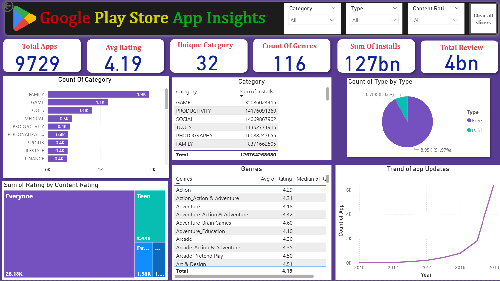

# 📊 Google Play Store App Insights

## 📸 Dashboard Preview

**An interactive Power BI dashboard exploring trends in the Google Play Store ecosystem.**

## 📌Project Overview

This project analyzes Google Play Store applications using Power BI to uncover trends in app categories, ratings, installs, and pricing models.

The objective is to extract meaningful business insights that can support app developers and decision-makers in understanding market behavior.

## 🎯Business Objectives

-Identify most popular app categories

-Analyze Free vs Paid distribution

-Study rating patterns

-Evaluate install growth trends

-Compare genre performance

 ## 🧹 Data Cleaning & Preparation

**Data was thoroughly cleaned in Microsoft Excel prior to dashboard creation:**

-Removed duplicate app entries

-Handled missing/null values in ratings and installs

-Standardized date formats

-Converted metrics into proper data types for Power BI ingestion

## 📌Key Dashboard Features

Category Filter – View performance for specific app categories

Developer Filter – Analyze apps from a selected developer

Date Range Slider – Filter data by date

Average Rating Gauge – Visual representation of user ratings (0.0 - 5.0 scale)

Monthly Installs Trend – Track app adoption over time

Installs & Uninstalls Pie Charts – % distribution of total downloads

Average Session Duration – Highlighted for quick engagement insights

**App Statistics Table – Displays detailed app metrics:**

Total installs

Total uninstalls

Average rating

Review count

Monthly active users

 ## 🛠 Tools Used

Microsoft Excel – For data cleaning

Power BI – For data visualization and dashboard creation

 ## 📊 Key Insights

- Free apps dominate the market (~92%)
- Family & Game categories have highest app count
- Significant trend of updates observed In-2018
- Average app rating is 4.19

